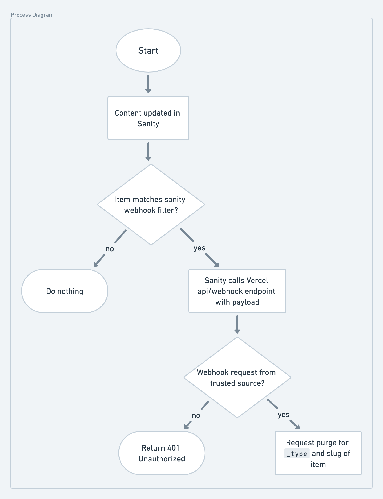

# E-Commerce – powered by Next.js + Sanity CMS + Fastly

This repo contains a demo of a (partial) e-commerce site powered by [Next.js](https://nextjs.org/), [Sanity CMS](https://www.sanity.io/), and [Fastly](https://www.fastly.com/). The goal of the project is to provide a realistic demonstration of running a highly performant and available e-commerce site with data sourced from Sanity's headless CMS.

The general architecture of the site is shown below:

The e-commerce data is stored in a headless CMS (powered by Sanity). The project uses Next.js (deployed on Vercel) to render the site, and Fastly is placed in front of Vercel to cache server-rendered webpages for _speed_ and availability.

Therefore, the project can be broken down into the following three constituent parts.

## The Headless CMS (powered by Sanity)

Sanity is used for storing information about our e-commerce products. The data from Sanity is fetched using Groq [Groq](https://www.sanity.io/docs/groq) – a query language, used for fetching data. Formidable built [Groqd](https://formidable.com/open-source/groqd/) – a schema-unaware, runtime and type-safe query builder for GROQ.

### Sanity Studio

Sanity Studio is a web interface for Sanity's headless CMS. It is used for creating and editing the data on the site. The models for Sanity are created in code and tracked in source control. The models can be found at [`packages/nextjs/sanity-studio/schemas`](./packages/sanity/schemas). Sanity Studio is integrated into the NextJS application and deployed alongside as a route at `/studio`.

  

If you want to poke around the Studio site, you will need to go through the steps of creating your own Sanity account and project. Instructions for that can be found in [the setup guide](./setup.md).

## The Next.js app

To show the CMS data to end-users we created a Next.js web app that server-renders some common e-commerce pages, including a landing page, a Product Listing Page (PLP) with sorting and filtering, and a Product Details Page (PDP).

The CMS data is fetched on the server via GROQ using the standard `fetch` API. With a sprinkle of [TailwindCSS](https://tailwindcss.com/) styling we have something that looks like the following.

  

The Next.js app is deployed to [Vercel](https://vercel.com) via their git pipeline. In a real-world e-commerce app, we expect to experience some heavy loads on pages whose data doesn't change much between visits, and therefore we can deploy caching strategies to reduce the load on our source server.

## Fastly CDN and Caching

In order to enhance the speed of the app, we are utilizing Fastly's CDN with a high cache-lifetime for server-rendered pages. We are using Fastly to both cache and host the subdomain used for this showcase app. The data flow involved in caching is illustrated below.

See [caching details](#fastly-caching-details) for some technical details on how the caching is implemented.

The caveat to this approach of aggressive caching is that it is important to invalidate the cache when our source data changes. Otherwise, we will be showing stale data to end-users, even if that data has been updated in the CMS. See [cache invalidation and purging](#cache-invalidation-and-purging) for more details on cache invalidation.

### Fastly Caching Details

To cache our server-rendered pages at the Fastly layer, we use response headers to indicate what/how we want Fastly to cache our responses from the source server. We need to a couple key ingredients:

1. `Surrogate-Control` response header needs to be added to pages where caching is desired ([reference](https://docs.fastly.com/en/guides/working-with-surrogate-keys)),
2. `Surrogate-Key` response header needs to be added to enable appropriate cache invalidation ([reference](https://developer.fastly.com/reference/api/purging/)).

On the Next.js side we'll need to include a few primary response headers to then control caching (in our case, we're setting these headers from `middleware` on server-rendered pages that we'd like to cache).

- `surrogate-control` – Fastly-specific header used to set the cache policies. (`max-age`, `stale-while-revalidate`, `stale-while-error`).
- `surrogate-key` – Fastly-specific header that allows purging by key. Note: this header is removed by Fastly before sending the response to the client. To see the value of this header, you must include the [`Fastly-Debug`](https://developer.fastly.com/reference/http/http-headers/Fastly-Debug/) header in your request.
- `cache-control` – used to indicate to browsers and Vercel to not cache so that we can handle caching solely at the Fastly layer.

With these response headers implemented, Fastly will start caching our responses and give us a path to invalidate our cache when necessary.

In our case, we use data items' `slug`s as part of our `surrogate-key` header to indicate what items' data are used to render a page so that we can invalidate accordingly when any of those items' data changes.

### Cache Invalidation and Purging

We need to invalidate our Fastly cache whenever data in our Sanity CMS instance changes. To do this, we use [Sanity webhooks](https://www.sanity.io/docs/webhooks) to trigger purging whenever our CMS data changes. The general flow for this is shown below.

When CMS data changes, a Sanity webhook is triggered and makes a request to an API endpoint in our Next.js app. The endpoint does some validation on the request (to make sure it's coming from a trusted Sanity webhook), and then makes a request to Fastly's API to invalidate/purge our cache accordingly. The Sanity webhook payload contains information (in our case, an item's [`slug`](https://www.sanity.io/docs/slug-type)) about what data changes, and our API endpoint uses that `slug` to tell Fastly which cache data to invalidate (based on the `surrogate-key` set in the original response header).

<!-- TODO: Diagram for this flow, too... -->

#### Purging on code deploy

We discussed invalidating our cache when our source data changes. However, our source _code_ can also alter our HTML response, and our Fastly cache is not aware of when we deploy code changes. Therefore, we also need to purge our entire cache when we deploy code. We do this via a GitHub Action that runs in CI; you can find the action details in [`.github/workflows/purgeFastly`](./.github/workflows/purgeFastly.yml).
